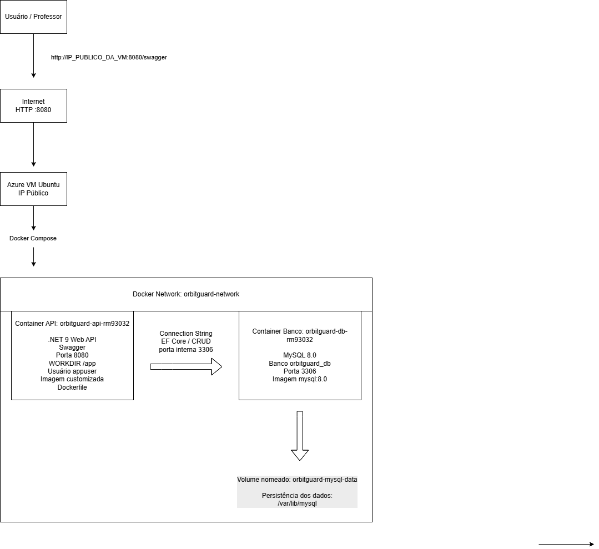

# OrbitGuard Climate

API conteinerizada para monitoramento de áreas de risco climático usando dados simulados de satélite.

---

## Sobre o projeto

O **OrbitGuard Climate** é uma solução DevOps criada para a Global Solution 2026/1 da FIAP.

A proposta conecta o tema da economia espacial com um problema real da Terra: o monitoramento climático de áreas vulneráveis. A aplicação simula o uso de dados orbitais/satelitais para acompanhar áreas de risco, registrar leituras ambientais e gerar alertas climáticos.

A solução permite:

- cadastrar áreas monitoradas;
- registrar leituras simuladas de satélite;
- gerar alertas climáticos;
- consultar dados persistidos no banco;
- testar operações CRUD pela API;
- executar toda a aplicação com Docker Compose;
- comprovar persistência dos dados usando volume nomeado;
- executar a solução em uma VM Linux em nuvem.

Toda a solução roda em containers Docker integrados, com uma API .NET e um banco MySQL na mesma rede Docker.

---

## Tecnologias utilizadas

- .NET 9 Web API
- Entity Framework Core
- Pomelo Entity Framework Core MySQL
- MySQL 8.0
- Docker
- Docker Compose
- Swagger
- Git
- GitHub
- DigitalOcean Droplet Ubuntu
- Cloud VM Linux

---

## Tema da solução

O projeto está relacionado ao tema da economia espacial porque utiliza o conceito de dados simulados de satélite para monitorar áreas terrestres vulneráveis a eventos climáticos.

Exemplo de uso:

> Uma área agrícola é cadastrada no sistema. Depois, uma leitura simulada de satélite registra temperatura, umidade, chuva e índice de vegetação. Com base nesses dados, a API registra um alerta climático, como risco de seca ou calor extremo.

---

## Estrutura da solução

A aplicação possui três tabelas principais:

### monitored_areas

Representa uma área monitorada.

Exemplo:

- Fazenda Aurora
- Ribeirão Preto - SP
- Nível de risco: MEDIUM

Campos principais:

```text
id
name
location
latitude
longitude
risk_level
created_at
```

---

### satellite_readings

Representa uma leitura simulada de satélite sobre uma área monitorada.

Exemplo:

- Temperatura
- Umidade
- Chuva estimada
- Índice de vegetação

Campos principais:

```text
id
monitored_area_id
temperature
humidity
rainfall
vegetation_index
captured_at
```

---

### climate_alerts

Representa um alerta climático gerado a partir de uma área e de uma leitura.

Exemplo:

- Tipo: DROUGHT_RISK
- Severidade: CRITICAL
- Status: IN_ANALYSIS

Campos principais:

```text
id
monitored_area_id
satellite_reading_id
alert_type
severity
description
status
created_at
```

---

## Relacionamento entre tabelas

```text
monitored_areas 1:N satellite_readings

monitored_areas 1:N climate_alerts

satellite_readings 1:N climate_alerts
```

Fluxo lógico:

```text
Área monitorada
      ↓
Leitura de satélite simulada
      ↓
Alerta climático
```

Explicação:

- Uma área monitorada pode possuir várias leituras de satélite.
- Uma área monitorada pode possuir vários alertas climáticos.
- Uma leitura de satélite pode estar associada a alertas climáticos.

---

## Arquitetura macro da solução



```text
Usuário / Professor
        |
        | HTTP :8080
        v
Cloud VM Linux
DigitalOcean Droplet Ubuntu
IP público: 146.190.218.162
        |
        v
Docker Compose
        |
        +------------------------------------------------+
        | Docker Network: orbitguard-network             |
        |                                                |
        |  Container da API                              |
        |  Nome: orbitguard-api-rm93032                  |
        |  Tecnologia: .NET 9 Web API                    |
        |  Porta: 8080                                   |
        |  Usuário não-root: appuser                     |
        |  Diretório de trabalho: /app                   |
        |                                                |
        |             comunicação interna                |
        |                                                |
        |  Container do Banco                            |
        |  Nome: orbitguard-db-rm93032                   |
        |  Tecnologia: MySQL 8.0                         |
        |  Porta: 3306                                   |
        |  Volume nomeado: orbitguard-mysql-data         |
        +------------------------------------------------+
```

---

## Containers da solução

### Container da aplicação

Nome do container:

```text
orbitguard-api-rm93032
```

Características:

- Imagem personalizada criada via Dockerfile.
- Executa uma API .NET 9.
- Usa usuário não privilegiado: `appuser`.
- Define diretório de trabalho: `/app`.
- Expõe a porta `8080`.
- Usa variáveis de ambiente no Docker Compose.
- Conecta ao banco MySQL pela rede Docker.

---

### Container do banco de dados

Nome do container:

```text
orbitguard-db-rm93032
```

Características:

- Usa imagem pública `mysql:8.0`.
- Expõe a porta `3306`.
- Usa volume nomeado para persistência.
- Usa variáveis de ambiente para criação do banco.
- Executa na mesma rede Docker da API.

Banco utilizado:

```text
orbitguard_db
```

Usuário do banco:

```text
orbitguard_user
```

---

## Estrutura de pastas

```text
orbitguard-climate/
├── OrbitGuard.Api/
│   ├── Controllers/
│   ├── Data/
│   ├── Models/
│   ├── Migrations/
│   ├── Program.cs
│   ├── appsettings.json
│   └── OrbitGuard.Api.csproj
├── docs/
│   └── arquitetura-orbitguard.png
├── Dockerfile
├── docker-compose.yml
├── .dockerignore
├── .gitignore
└── README.md
```

---

## Como executar localmente

### Pré-requisitos

- Docker Desktop instalado.
- Git instalado.
- Porta `8080` livre para a API.
- Porta `3306` livre para o MySQL.

---

### Clonar o repositório

```bash
git clone https://github.com/andteixeira10/orbitguard-climate
cd orbitguard-climate
```

---

### Subir os containers

```bash
docker compose up -d --build
```

Caso o ambiente utilize Docker Compose v1, usar:

```bash
docker-compose up -d --build
```

Esse comando:

- cria a imagem personalizada da API;
- baixa a imagem do MySQL;
- cria a rede Docker;
- cria o volume nomeado;
- sobe os containers em segundo plano.

---

### Verificar containers em execução

```bash
docker ps
```

Resultado esperado:

```text
orbitguard-api-rm93032
orbitguard-db-rm93032
```

A API deve aparecer com a porta:

```text
0.0.0.0:8080->8080/tcp
```

O banco deve aparecer com a porta:

```text
0.0.0.0:3306->3306/tcp
```

---

### Testar rota principal da API

```bash
curl http://localhost:8080
```

Resultado esperado:

```json
{
  "application": "OrbitGuard Climate API",
  "status": "running",
  "database": "MySQL",
  "containers": [
    "orbitguard-api-rm93032",
    "orbitguard-db-rm93032"
  ]
}
```

---

### Acessar o Swagger local

No navegador:

```text
http://localhost:8080/swagger
```

O Swagger permite testar os endpoints CRUD da API.

---

## Execução em nuvem

A solução foi executada em uma **DigitalOcean Droplet Ubuntu**, representando uma VM Linux em nuvem.

Dados da execução em nuvem:

```text
Cloud Provider: DigitalOcean
Tipo: Droplet Ubuntu
Hostname: vm-orbitguard-rm93032
IP público: 146.190.218.162
Aplicação: Docker Compose com API .NET e MySQL
```

URL da API em nuvem:

```text
http://146.190.218.162:8080
```

URL do Swagger em nuvem:

```text
http://146.190.218.162:8080/swagger
```

---

## Como executar na VM Linux em nuvem

### Acessar a VM por SSH

```bash
ssh root@146.190.218.162
```

---

### Clonar o repositório

```bash
git clone https://github.com/andteixeira10/orbitguard-climate.git
cd orbitguard-climate
```

---

### Subir os containers na VM

Na VM Linux, foi utilizado Docker Compose v1:

```bash
docker-compose up -d --build
```

Também é possível usar Docker Compose v2, caso esteja instalado:

```bash
docker compose up -d --build
```

---

### Verificar containers em execução na nuvem

```bash
docker ps
```

Resultado esperado:

```text
orbitguard-api-rm93032
orbitguard-db-rm93032
```

Portas publicadas:

```text
0.0.0.0:8080->8080/tcp
0.0.0.0:3306->3306/tcp
```

---

## Endpoints da API

### Áreas monitoradas

```http
GET    /api/areas
GET    /api/areas/{id}
POST   /api/areas
PUT    /api/areas/{id}
DELETE /api/areas/{id}
```

---

### Leituras de satélite

```http
GET    /api/readings
GET    /api/readings/{id}
POST   /api/readings
PUT    /api/readings/{id}
DELETE /api/readings/{id}
```

---

### Alertas climáticos

```http
GET    /api/alerts
GET    /api/alerts/{id}
POST   /api/alerts
PUT    /api/alerts/{id}
DELETE /api/alerts/{id}
```

---

## Exemplos de teste pelo Swagger

### 1. Criar área monitorada

Endpoint:

```http
POST /api/areas
```

Body:

```json
{
  "name": "Fazenda Aurora",
  "location": "Ribeirao Preto - SP",
  "latitude": -21.1775,
  "longitude": -47.8103,
  "riskLevel": "MEDIUM"
}
```

---

### 2. Listar áreas monitoradas

Endpoint:

```http
GET /api/areas
```

---

### 3. Atualizar área monitorada

Endpoint:

```http
PUT /api/areas/1
```

Body:

```json
{
  "name": "Fazenda Aurora Atualizada",
  "location": "Ribeirao Preto - SP",
  "latitude": -21.1775,
  "longitude": -47.8103,
  "riskLevel": "HIGH"
}
```

---

### 4. Criar leitura de satélite

Endpoint:

```http
POST /api/readings
```

Body:

```json
{
  "monitoredAreaId": 1,
  "temperature": 38.5,
  "humidity": 22.0,
  "rainfall": 0.0,
  "vegetationIndex": 0.31
}
```

---

### 5. Listar leituras de satélite

Endpoint:

```http
GET /api/readings
```

---

### 6. Criar alerta climático

Endpoint:

```http
POST /api/alerts
```

Body:

```json
{
  "monitoredAreaId": 1,
  "satelliteReadingId": 1,
  "alertType": "DROUGHT_RISK",
  "severity": "CRITICAL",
  "description": "Risco critico de seca identificado por baixa umidade e ausencia de chuva na leitura orbital simulada.",
  "status": "IN_ANALYSIS"
}
```

---

### 7. Listar alertas climáticos

Endpoint:

```http
GET /api/alerts
```

---

### 8. Atualizar alerta climático

Endpoint:

```http
PUT /api/alerts/1
```

Body:

```json
{
  "monitoredAreaId": 1,
  "satelliteReadingId": 1,
  "alertType": "DROUGHT_RISK",
  "severity": "CRITICAL",
  "description": "Alerta atualizado apos nova analise dos dados simulados de satelite.",
  "status": "CONFIRMED"
}
```

---

### 9. Deletar alerta climático

Endpoint:

```http
DELETE /api/alerts/1
```

---

## Evidências Docker

### Ver versões instaladas

```bash
docker --version
docker-compose --version
```

---

### Ver containers rodando

```bash
docker ps
```

Resultado esperado:

```text
orbitguard-api-rm93032
orbitguard-db-rm93032
```

---

### Ver logs da API

```bash
docker logs --tail 100 orbitguard-api-rm93032
```

Esse comando demonstra a inicialização da API, a aplicação das migrations e as requisições realizadas nos endpoints.

---

### Ver logs do banco

```bash
docker logs --tail 100 orbitguard-db-rm93032
```

Esse comando demonstra a inicialização do MySQL.

---

## Acessar o container da API

```bash
docker container exec -it orbitguard-api-rm93032 sh
```

Comandos dentro do container:

```bash
pwd
ls -l
whoami
```

Resultado esperado:

```text
pwd: /app
whoami: appuser
```

Esse teste comprova que:

- o diretório de trabalho foi definido;
- a aplicação está no diretório `/app`;
- o container da aplicação não está rodando como root.

Para sair:

```bash
exit
```

---

## Acessar o container do banco

```bash
docker container exec -it orbitguard-db-rm93032 bash
```

Comandos dentro do container:

```bash
pwd
ls -l
whoami
```

Para sair:

```bash
exit
```

---

## Consultas SQL de evidência

As consultas abaixo são executadas diretamente dentro do container MySQL, usando `docker exec`.

### Listar tabelas

```bash
docker exec -e MYSQL_PWD=orbitguard_pass -it orbitguard-db-rm93032 mysql -uorbitguard_user -t -e "USE orbitguard_db; SHOW TABLES;"
```

---

### Consultar dados das tabelas

```bash
docker exec -e MYSQL_PWD=orbitguard_pass -it orbitguard-db-rm93032 mysql -uorbitguard_user -t -e "USE orbitguard_db; SELECT 'monitored_areas' AS tabela; SELECT * FROM monitored_areas; SELECT 'satellite_readings' AS tabela; SELECT * FROM satellite_readings; SELECT 'climate_alerts' AS tabela; SELECT * FROM climate_alerts;"
```

---

### SELECT com relacionamento entre as tabelas

```bash
docker exec -e MYSQL_PWD=orbitguard_pass -it orbitguard-db-rm93032 mysql -uorbitguard_user -t -e "USE orbitguard_db; SELECT a.name AS area_name, a.location, r.temperature, r.humidity, r.rainfall, r.vegetation_index, c.alert_type, c.severity, c.status FROM climate_alerts c JOIN monitored_areas a ON a.id = c.monitored_area_id LEFT JOIN satellite_readings r ON r.id = c.satellite_reading_id;"
```

Esse SELECT demonstra o relacionamento entre:

- área monitorada;
- leitura simulada de satélite;
- alerta climático.

---

## Teste de persistência do volume

Para testar a persistência, os containers podem ser removidos sem apagar o volume:

```bash
docker-compose down
```

Depois, subir novamente:

```bash
docker-compose up -d
```

Verificar os containers:

```bash
docker ps
```

Consultar os dados persistidos:

```bash
docker exec -e MYSQL_PWD=orbitguard_pass -it orbitguard-db-rm93032 mysql -uorbitguard_user -t -e "USE orbitguard_db; SELECT 'monitored_areas' AS tabela; SELECT * FROM monitored_areas; SELECT 'satellite_readings' AS tabela; SELECT * FROM satellite_readings; SELECT 'climate_alerts' AS tabela; SELECT * FROM climate_alerts;"
```

Se os dados continuarem aparecendo, o volume nomeado está funcionando corretamente.

Observação importante:

```text
docker-compose down      mantém o volume e preserva os dados
docker-compose down -v   remove o volume e apaga os dados
```

---

## Volume nomeado

O volume utilizado pelo MySQL é:

```text
orbitguard-mysql-data
```

No Docker Compose, ele é montado em:

```text
/var/lib/mysql
```

Para listar volumes:

```bash
docker volume ls
```

Para inspecionar o volume:

```bash
docker volume inspect orbitguard-climate_orbitguard-mysql-data
```

Esse volume garante que os dados do banco não sejam perdidos quando os containers são removidos e recriados sem o parâmetro `-v`.

---

## Rede Docker

A rede utilizada pela solução é:

```text
orbitguard-network
```

A API se comunica com o banco usando o nome do container do banco:

```text
orbitguard-db-rm93032
```

Connection string usada no Docker Compose:

```text
server=orbitguard-db-rm93032;port=3306;database=orbitguard_db;user=orbitguard_user;password=orbitguard_pass
```

---

## Checklist de evidências para o vídeo

Durante o vídeo demonstrativo, mostrar:

- repositório GitHub;
- VM Linux em nuvem;
- clone do repositório;
- entrada na pasta do projeto;
- execução do `docker-compose up -d --build`;
- containers rodando com `docker ps`;
- logs da API com `docker logs --tail 100 orbitguard-api-rm93032`;
- logs do banco com `docker logs --tail 100 orbitguard-db-rm93032`;
- acesso ao container da API com `docker container exec`;
- comandos `pwd`, `ls -l` e `whoami` na API;
- acesso ao container do banco com `docker container exec`;
- comandos `pwd`, `ls -l` e `whoami` no banco;
- Swagger aberto pelo IP público;
- teste de CRUD;
- SELECT direto no MySQL;
- SELECT com relacionamento;
- volume nomeado;
- teste de persistência com `docker-compose down` e `docker-compose up -d`.

---

## Parar os containers

```bash
docker-compose down
```

---

## Parar os containers e apagar os dados

Atenção: este comando remove o volume e apaga os dados do banco.

```bash
docker-compose down -v
```

---

## Integrantes

| Nome | RM | Turma |
|---|---|---|
| André Teixeira Alves Filho | 93032 | 2TDSR |

---

## Links da entrega

Repositório GitHub:

```text
https://github.com/andteixeira10/orbitguard-climate
```

API em nuvem:

```text
http://146.190.218.162:8080
```

Swagger em nuvem:

```text
http://146.190.218.162:8080/swagger
```

Vídeo demonstrativo:

```text
LINK_DO_VIDEO
```

Pitch:

```text
LINK_DO_PITCH
```

---